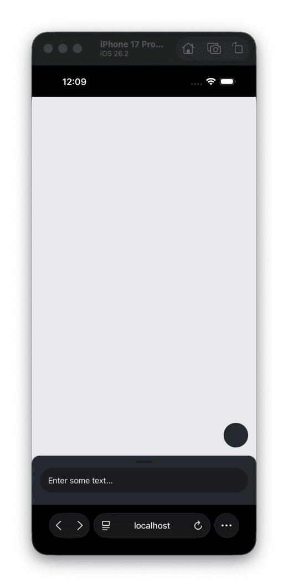

# React Native True Sheet

[](https://github.com/lodev09/react-native-true-sheet/actions/workflows/ci.yml)
[](https://www.npmjs.com/package/@lodev09/react-native-true-sheet)

> [!NOTE]
> 🎉 **Version 3.0 is here!** Completely rebuilt for Fabric with new features like automatic ScrollView detection, native headers/footers, sheet stacking, and more. [Read the announcement](https://sheet.lodev09.com/blog/release-3-0)

The true native bottom sheet experience for your React Native Apps. 💩



## Features

* ⚡ **Powered by Fabric** - Built on React Native's new architecture for maximum performance
* 🚀 **Fully Native** - Implemented in the native realm, zero JS hacks
* ♿ **Accessible** - Native accessibility and screen reader support out of the box
* 🔄 **Flexible API** - Use [imperative methods](https://sheet.lodev09.com/reference/methods#ref-methods) or [lifecycle events](https://sheet.lodev09.com/reference/events)
* 🪟 **Liquid Glass** - [iOS 26+ Liquid Glass](https://sheet.lodev09.com/guides/liquid-glass) support out of the box, featured in [Expo Blog](https://expo.dev/blog/how-to-create-apple-maps-style-liquid-glass-sheets)
* 🐎 **Reanimated** - First-class support for [react-native-reanimated](https://sheet.lodev09.com/guides/reanimated)
* 🧭 **React Navigation** - Built-in [sheet navigator](https://sheet.lodev09.com/guides/navigation) for seamless navigation integration
* 🌐 **Web Support** - Full [web support](https://sheet.lodev09.com/guides/web) out of the box

## Installation

> [!IMPORTANT]
> **Version 3.0+ requires React Native's New Architecture (Fabric)**
> For the old architecture, use version 2.x. See the [Migration Guide](https://sheet.lodev09.com/migration) for upgrading.

### Prerequisites

- React Native >= 0.76 (Expo SDK 52+)
- New Architecture enabled (default in RN 0.76+)

### Expo

```sh
npx expo install @lodev09/react-native-true-sheet
```

### Bare React Native

```sh
yarn add @lodev09/react-native-true-sheet
cd ios && pod install
```

## Documentation

- [Example](example)
- [Configuration](https://sheet.lodev09.com/reference/configuration)
- [Lifecycle Events](https://sheet.lodev09.com/reference/events)
- [React Navigation](https://sheet.lodev09.com/guides/navigation)
- [Troubleshooting](https://sheet.lodev09.com/troubleshooting)
- [Testing with Jest](https://sheet.lodev09.com/guides/jest)
- [Migrating to v3](https://sheet.lodev09.com/migration)

## Usage

```tsx
import { TrueSheet } from "@lodev09/react-native-true-sheet"

export const App = () => {
  const sheet = useRef<TrueSheet>(null)

  // Present the sheet ✅
  const present = async () => {
    await sheet.current?.present()
    console.log('horray! sheet has been presented 💩')
  }

  // Dismiss the sheet ✅
  const dismiss = async () => {
    await sheet.current?.dismiss()
    console.log('Bye bye 👋')
  }

  return (
    <View>
      <Button onPress={present} title="Present" />
      <TrueSheet
        ref={sheet}
        detents={['auto', 1]}
      >
        <Button onPress={dismiss} title="Dismiss" />
      </TrueSheet>
    </View>
  )
}
```

## Testing

TrueSheet exports mocks for easy testing:

```tsx
// Main component
jest.mock('@lodev09/react-native-true-sheet', () =>
  require('@lodev09/react-native-true-sheet/mock')
);

// Navigation (if using)
jest.mock('@lodev09/react-native-true-sheet/navigation', () =>
  require('@lodev09/react-native-true-sheet/navigation/mock')
);

// Reanimated (if using)
jest.mock('@lodev09/react-native-true-sheet/reanimated', () =>
  require('@lodev09/react-native-true-sheet/reanimated/mock')
);
```

All methods (`present`, `dismiss`, `resize`) are mocked as Jest functions, allowing you to test your components without native dependencies.

**[Full Testing Guide](https://sheet.lodev09.com/guides/jest)**

## Contributing

See the [contributing guide](CONTRIBUTING.md) to learn how to contribute to the repository and the development workflow.

## License

[MIT](LICENSE)

---

Made with ❤️ by [@lodev09](http://linkedin.com/in/lodev09/)
